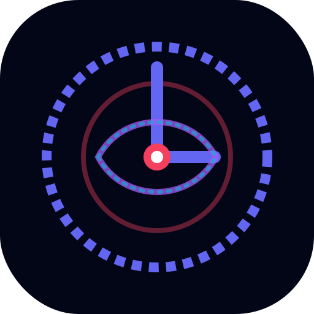

<div align="center">



<h1>Chronos AI</h1>

<p><strong>Decision Support AI for the Optimistic Builder</strong></p>

<p><em>"Chronos doesn't automate your calendar. It corrects your judgment."</em></p>

<br/>

[](https://github.com/callmerishi1508/Chronos-AI)
[](https://aistudio.google.com)
[](LICENSE)
[](public/manifest.json)
[](tsconfig.json)
[](package.json)

<br/>

> **🚀 [Try Chronos AI Live Here](https://github.com/callmerishi1508/Chronos-AI)**  
> *(Judges: No installation required. Click above for the live deployment)*

<br/>

[**Gemini Showcase**](docs/GEMINI_USAGE.md) · [**Architecture Overview**](docs/SYSTEM_ARCHITECTURE.md) · [**Demo Script**](docs/DEMO_FAILURE_PLAYBOOK.md)

</div>

---

## The Problem

Every developer, founder, and builder has experienced this: you plan carefully, work hard — and still miss the deadline.

This isn't a time management problem. It's a **cognitive calibration problem.**

Research identifies it as the **Planning Fallacy** — the universal human bias toward underestimating how long tasks take. For software engineers, the underestimation gap reaches **+63% on complex engineering work**. Every productivity tool on the market assumes your estimates are correct. They optimize *within* broken plans, guaranteeing the failure they claim to prevent.

> **The insight:** By the time your calendar app tells you you're behind, the failure has already been committed. What you need is intervention *before* the cascade.

---

## The Solution

**Chronos AI** introduces a new category: **Decision Support AI.**

Not a to-do list. Not a calendar. Not a scheduler.

A cognitive intervention system that watches your task load in real time, calculates the gap between your ambitions and your historical capacity, names it — the **Cognitive Optimism Tax** — and uses Google Gemini 2.5 Flash to generate specific, data-backed recovery plans before your deadline collapses.

```
Most tools ask: "What should I work on?"
Chronos asks:   "Why are you going to fail — and what do we do right now?"
```

---

## Key Features

### 🎯 Predictive Threat Radar
Real-time dashboard showing four risk vectors simultaneously:
- **Failure Probability** — live success score recalculated on every task change
- **Cognitive Optimism Tax** — your quantified underestimation bias per task category
- **Concurrency Debt** — compounding penalty from simultaneous high-context tasks
- **Scope Overload** — detection of over-committed timelines before they collapse

### 🔄 Autonomous Recovery Engine
When risk exceeds threshold, Gemini 2.5 Flash analyzes your task load and returns a structured recovery plan: which tasks to descope, delay, or delegate — ranked by timeline impact with confidence scores.

### 🔍 Transparent XAI Inspector
Every AI recommendation has a **[WHY?]** button. Click it and the Chronos Reasoning Inspector opens — six explainability panels showing the complete causal chain behind the decision:
- **Success Breakdown** — every factor that's helping or hurting
- **Decision Trace** — step-by-step reasoning
- **Human OS Why** — behavioral and cognitive factors
- **Timeline Outcomes** — projected futures with and without action
- **Focus Shield Why** — why calendar blocks were placed where they were
- **Intervention Why** — emergency action justification

> This is not a black box. Every AI decision is auditable.

### 🧬 Human OS — Deadline DNA Profile
A behavioral intelligence layer that builds your cognitive profile over time: chronotype mapping, procrastination pattern detection, focus genome metrics, and a personal optimism coefficient per task category.

### ⏱️ Future Self Simulator
Three-timeline visualization showing exactly what happens if you do nothing vs. apply the recovery plan:
- **Failure Autopsy** — projected outcome on current trajectory
- **Current Path** — realistic forecast
- **Recovered Future** — timeline after applying AI recovery plan

### 🚨 Emergency Intervention
"I'm Overwhelmed" button triggers immediate AI triage. Gemini generates a 5-minute crisis protocol: what to do in the next 300 seconds to stop the bleeding.

### 📡 Local Intelligence — Offline Resilience
Three-tier fallback architecture maximizes application availability:
1. `gemini-2.5-flash` → primary
2. `gemini-2.5-flash-lite` → fallback on 503/429
3. Local heuristic engine → fallback on complete failure

Every API endpoint returns `HTTP 200` regardless of Gemini availability. The `LOCAL INTELLIGENCE ACTIVE` badge in the header tells users exactly what mode they're in.

---

## Screenshots

*(Submitter: Add 2-3 high-quality screenshots here after deployment)*
- ``
- ``
- ``

---

## Why Google Gemini?

Chronos is built *around* Gemini — not bolted on top. Six distinct AI endpoints, each using `responseMimeType: "application/json"` for deterministic structured outputs:

| Endpoint | Gemini Role |
|----------|------------|
| `/api/recommendations` | Contextual task prioritization with psychological framing |
| `/api/recovery` | Multi-variable descope strategy with confidence scoring |
| `/api/reasoning` | Deep XAI causal chain — 6 reasoning panels |
| `/api/personal-intelligence` | Behavioral DNA profiling and archetype detection |
| `/api/future-simulation` | Three-timeline scenario modeling |
| `/api/emergency` | Crisis triage and 5-minute recovery protocol |

**What makes this usage deep:**
- `responseSchema` validation on every response — AI output is schema-enforced, not free-text parsed
- Prompt injection protection: `PROMPT_INJECTION_BOUNDARY` constraint on every call
- Accessibility constraints injected into every prompt
- Dual-model fallback logic built into the server, not the client
- API key is isolated from the browser — server-side proxy only

→ Full details: [docs/GEMINI_USAGE.md](docs/GEMINI_USAGE.md)

---

## The Agentic Loop

Chronos implements a **7-step agentic pipeline** that runs automatically whenever task state changes:

```
1. PERCEIVE   → Reads task list, calendar events, behavioral history
2. ANALYZE    → Calculates Optimism Tax, Concurrency Debt, Failure Probability
3. PREDICT    → Simulates three future timelines via Gemini
4. PLAN       → Generates ranked recovery actions with confidence scores
5. RECOVER    → Presents human-approved intervention options
6. EXPLAIN    → XAI Inspector exposes full reasoning chain on demand
7. ADAPT      → Falls back to Local Intelligence if Gemini unavailable
```

This is not single-shot prompting. It's a multi-stage AI pipeline with state persistence, self-correction, and graceful degradation.

→ Deep Dive: [docs/AGENTIC_ARCHITECTURE.md](docs/AGENTIC_ARCHITECTURE.md)

---

## Architecture Overview

Chronos utilizes a strict single-server topology (Vite + Express on port 3000). The React frontend communicates exclusively through `aiClient.ts`, which handles debouncing, caching, and local fallbacks. The Express backend securely proxies all requests to Google Gemini, injecting prompt boundaries and enforcing JSON schemas.

→ Full Diagram & Flows: [docs/ARCHITECTURE_DIAGRAMS.md](docs/ARCHITECTURE_DIAGRAMS.md)
→ Backend Deep Dive: [docs/SYSTEM_ARCHITECTURE.md](docs/SYSTEM_ARCHITECTURE.md)

---

## 🚀 Quick Start

### Prerequisites
- Node.js 18+
- [Google Gemini API Key](https://aistudio.google.com) (free tier works)

### Setup

```bash
# Clone
git clone https://github.com/callmerishi1508/Chronos-AI.git
cd Chronos-AI

# Install
npm install

# Configure
cp .env.example .env
# Edit .env — add your GEMINI_API_KEY
# (Note: If you don't add a key, Chronos will automatically start in offline "Local Intelligence" mode so you can still test the UI!)

# Run
npm run dev
# → http://localhost:3000
```

### First Run (30-Second "Aha!" Moment)
1. Open `http://localhost:3000`
2. Click the prominent **"Start Judge Demo (Bypass)"** button on the welcome screen. This instantly loads a pre-configured narrative, skipping all setup.
3. Look at the **Threat Radar** (Top Left) — notice the 85% failure probability.
4. Click **"Apply Critical Recovery Plan"** (Bottom Right) to see Gemini generate a rescue strategy.
5. Click any **[WHY?]** button to open the Reasoning Inspector and see exactly how Gemini arrived at that conclusion.
*(Pro-tip: Open your browser's Network tab to see the structured JSON streaming from our Express proxy in real time).*

### Production Build
```bash
npm run build
# Outputs: dist/ (frontend) + dist/server.cjs (backend)
# Run: node dist/server.cjs
```

---

## Tech Stack

| Layer | Technology | Version |
|-------|-----------|---------|
| AI | Google Gemini 2.5 Flash | via `@google/genai ^2.4.0` |
| Frontend | React + TypeScript | 19.0.1 / 5.8.2 |
| Build | Vite | 6.2.3 |
| Styling | Tailwind CSS | 4.1.14 |
| Backend | Express.js | 4.21.2 |
| Security | Helmet.js + express-rate-limit | 8.2.0 / 8.5.2 |
| Animations | Framer Motion | 12.23.24 |
| Icons | Lucide React | 0.546.0 |
| Runtime | Node.js | 18+ |

---

## Repository Structure

```
Chronos-AI/
├── server.ts                    # Entire backend: API + Gemini proxy (1,921 lines)
├── src/
│   ├── App.tsx                  # Main application state & routing
│   ├── components/              # 20 UI components
│   │   ├── ChronosCommandCenter.tsx      # Threat Radar, Focus Sprints
│   │   ├── ChronosReasoningInspector.tsx # XAI WHY? Inspector
│   │   ├── DeadlineRecoveryEngine.tsx    # AI Recovery Plan Builder
│   │   ├── PersonalTimeIntelligence.tsx  # Human OS / DNA Profile
│   │   ├── RecommendationEngine.tsx      # Gemini Recommendations
│   │   ├── JudgeDemoHUD.tsx             # Demo narrative controller
│   │   └── ...                          # 14 additional components
│   └── utils/
│       ├── aiClient.ts          # Caching, retry, debounce, fallback
│       ├── freeTierGuardian.ts  # API quota management
│       └── validator.ts         # Input/output validation
├── docs/
│   ├── GEMINI_USAGE.md          # Gemini API deep dive
│   ├── SYSTEM_ARCHITECTURE.md  # Full architecture docs
│   ├── DEMO_FAILURE_PLAYBOOK.md # Demo recovery guide
│   └── PROJECT_OVERVIEW.md     # 5-minute CEO summary
├── public/                      # PWA: manifest, service worker, icon
├── .env.example                 # Environment template
├── package.json                 # chronos-ai@1.0.4
└── LICENSE                      # MIT
```

---

## Documentation

| Document | Purpose |
|----------|---------|
| [Project Overview](docs/PROJECT_OVERVIEW.md) | 5-minute CEO summary — what, why, how |
| [Gemini Usage & Prompt Engineering](docs/GEMINI_USAGE.md) | All 6 endpoints, schemas, fallback strategy |
| [System Architecture](docs/SYSTEM_ARCHITECTURE.md) | Full backend and component map |
| [Agentic Architecture](docs/AGENTIC_ARCHITECTURE.md) | The 7-step Chronos Agent Loop |
| [Architecture Diagrams](docs/ARCHITECTURE_DIAGRAMS.md) | Visual system workflows (Mermaid) |
| [Google AI Showcase](docs/GOOGLE_AI_SHOWCASE.md) | Deep Gemini integration evidence |
| [Demo Failure Playbook](docs/DEMO_FAILURE_PLAYBOOK.md) | Demo recovery guide |

---

## Responsible AI

Chronos AI was built with responsible AI principles from the ground up:

- **Transparency:** Every AI recommendation has a [WHY?] button. No black boxes.
- **Human control:** No autonomous calendar changes — all actions require explicit user confirmation.
- **Honest attribution:** Every AI-generated item is badged "GEMINI 2.5 FLASH" or "LOCAL INTELLIGENCE."
- **Offline labeling:** When running in fallback mode, the "LOCAL INTELLIGENCE ACTIVE" badge is clearly visible.
- **Prompt safety:** `PROMPT_INJECTION_BOUNDARY` constraint injected into every Gemini call.
- **Schema enforcement:** AI outputs are validated against expected schemas before being rendered.

---

## Future Roadmap

- **Google Calendar Integration** — Bi-directional sync to read historical completion rates and auto-schedule recovery windows
- **IDE Extension** — VS Code plugin that senses actual coding velocity vs. estimated task size in real time
- **Team Dynamics** — Compounded Optimism Tax modeling across multi-developer sprints
- **Vertex AI Migration** — Move to Vertex AI for enterprise-grade reliability and fine-tuning capability

---

## License

MIT License — see [LICENSE](LICENSE) for details.

---

<div align="center">

**Built for the Google AI Hackathon**

*"The Planning Fallacy claims every ambitious project. Chronos is the antidote."*

[GitHub](https://github.com/callmerishi1508/Chronos-AI) · [Gemini API](https://aistudio.google.com) · [MIT License](LICENSE)

</div>
