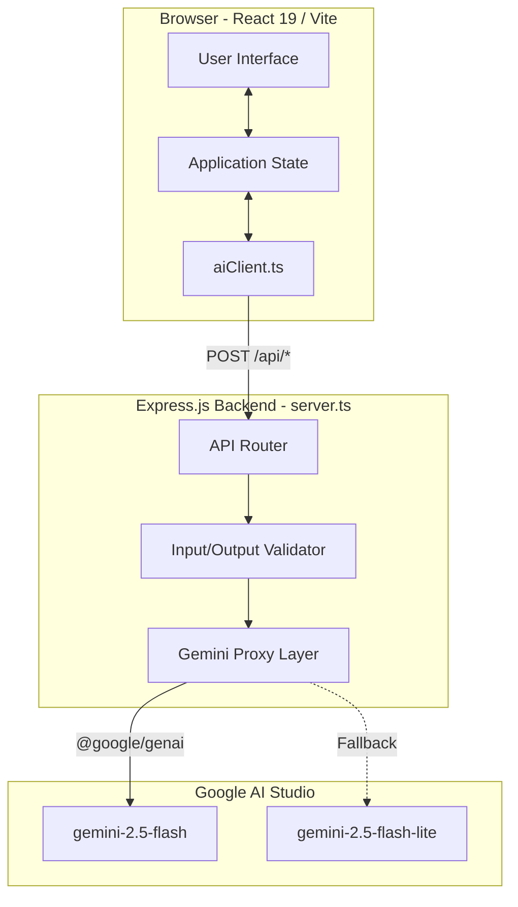
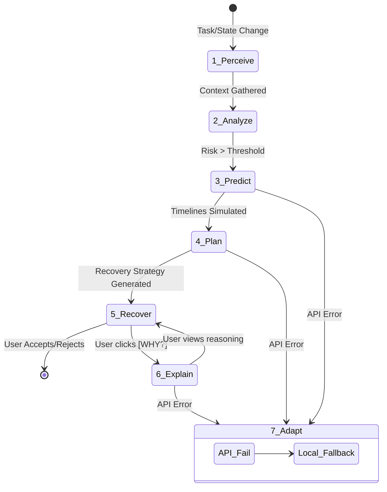
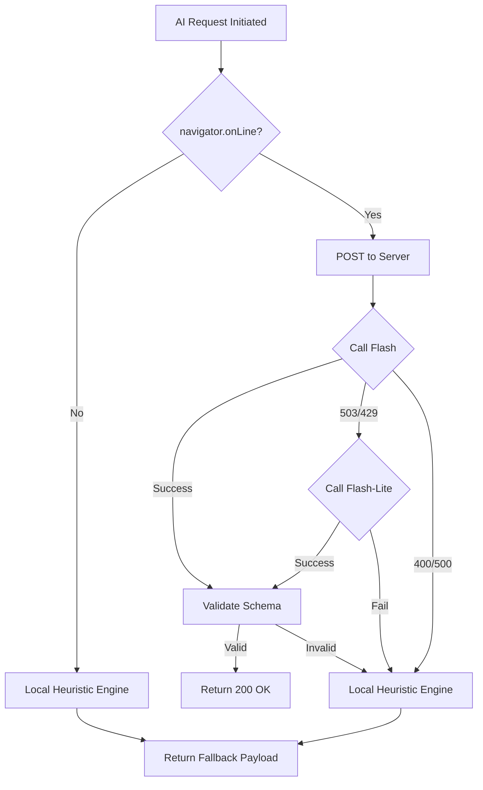
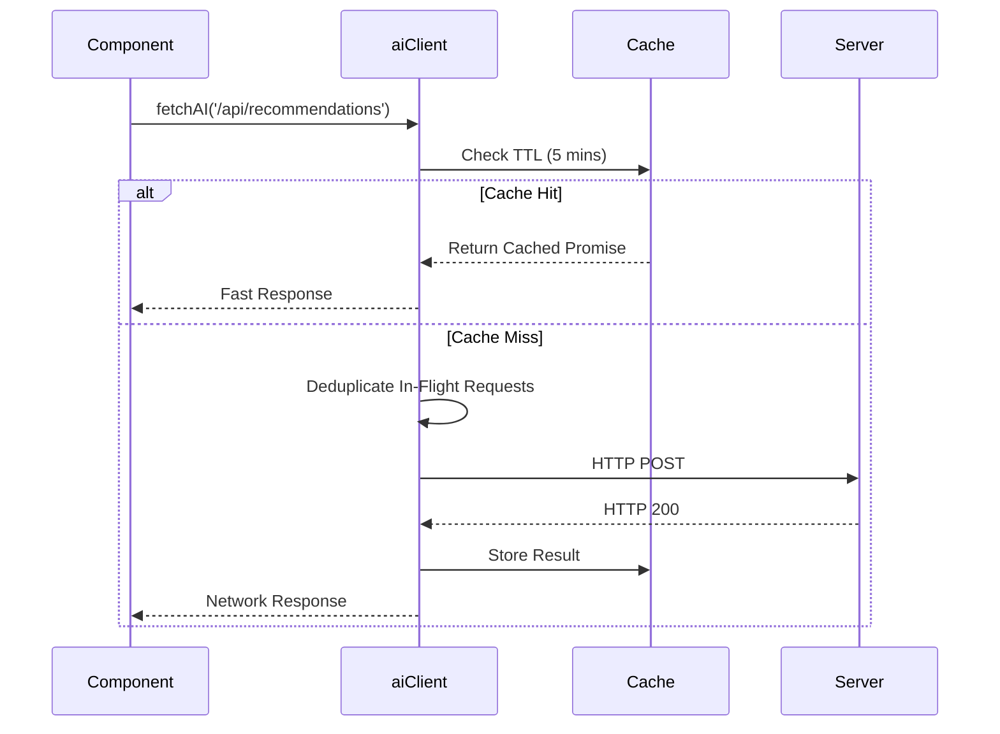

# Architecture Diagrams

**Chronos AI v1.0.4**

*These diagrams use Mermaid syntax. They illustrate the core data flows, agent loops, and fallback mechanisms of the Chronos AI system.*

## 1. Overall System Architecture

## 2. The 7-Stage Agent Workflow

## 3. Gemini Request Flow with Constraints

```mermaid
sequenceDiagram
    participant User
    participant App as React Frontend
    participant Server as Express (server.ts)
    participant Gemini as Google Gemini API
    
    User->>App: Triggers Action
    App->>Server: POST Context Data
    
    rect rgb(30, 41, 59)
        Note over Server: Inject Constraints
        Server->>Server: Append [ACCESSIBILITY]
        Server->>Server: Append [INTELLIGENCE]
        Server->>Server: Append [SECURITY_BOUNDARY]
    end
    
    Server->>Gemini: generateContent (JSON Mode)
    Gemini-->>Server: Raw JSON String
    
    rect rgb(30, 41, 59)
        Note over Server: Validation Layer
        Server->>Server: JSON.parse()
        Server->>Server: validateAIOutput(schema)
    end
    
    Server-->>App: Validated Data Object
    App-->>User: Rendered UI Component
```

## 4. High-Availability Fallback Flow

## 5. UI Request Lifecycle (Deduplication & Caching)

